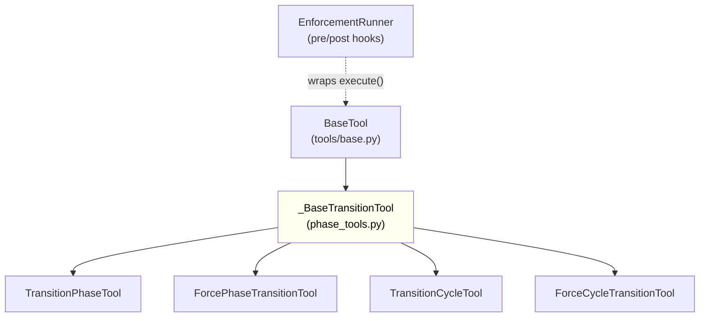
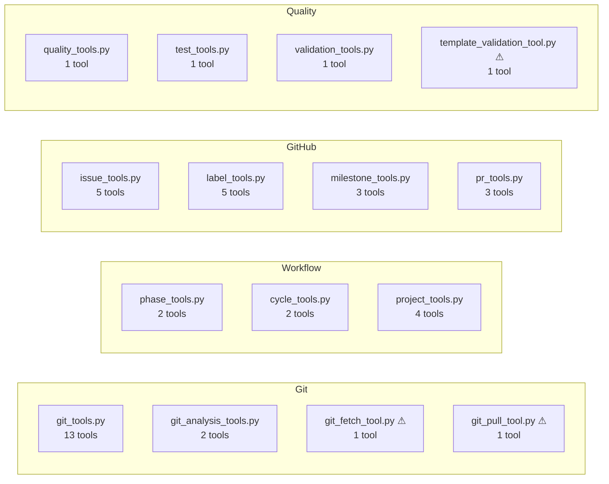

<!-- docs/mcp_server/architectural_diagrams/03_tool_layer.md -->
<!-- template=architecture version=8b924f78 created=2026-03-13T19:05Z updated=2026-03-13 -->
# Tool Layer

**Status:** DRAFT
**Version:** 1.0
**Last Updated:** 2026-03-13

---

## Purpose

Show the tool layer: all 49 MCP tools grouped by file, their base class hierarchy, naming
conventions, and existing inconsistencies.

## Scope

**In Scope:** `tools/` directory, BaseTool hierarchy, MCP tool names, file name conventions

**Out of Scope:** Tool implementation detail, manager-internal logic

---

## 1. Base Class Hierarchy

Every tool inherits from `BaseTool`. The `_BaseTransitionTool` sub-base provides shared
logic for both phase and cycle transition tools. The `EnforcementRunner` wraps `execute()`
as a pre/post-hook at the server level — tools themselves are unaware of enforcement.

The yellow `_BaseTransitionTool` is defined in `phase_tools.py` but imported by `cycle_tools.py` —
a visibility mismatch (see Known Issues).

---

## 2. Tool Groups by File

All 49 tools grouped by source file. Files marked (⚠) have naming convention violations.

Most files follow the `*_tools.py` (plural) convention. The four ⚠ files deviate.

---

## Constraints & Decisions

| Decision | Rationale | Alternatives Rejected |
|----------|-----------|----------------------|
| EnforcementRunner as pre/post hook at server level | Tools need not know about enforcement; clean separation of concerns | Enforcement logic inside each tool (duplication) |
| All tools via BaseTool | Uniform `execute()` interface; consistent `ToolResult` response shape | Standalone functions (no polymorphism, harder to wrap) |

---

## Known Architectural Issues

| ID | Component | Issue | Severity |
|----|-----------|-------|----------|
| KPI-11 | `_BaseTransitionTool` | Underscore prefix signals module-private, but imported by `cycle_tools.py` from `phase_tools.py` | Medium |
| KPI-11 | `git_fetch_tool.py` | Singular filename vs. `*_tools.py` plural convention for all other files | Low |
| KPI-11 | `git_pull_tool.py` | Same singular/plural deviation | Low |
| KPI-11 | `template_validation_tool.py` | Singular filename deviation | Low |
| KPI-12 | MCP names | `transition_phase` / `force_phase_transition` — word order is crossed vs. `transition_cycle` / `force_cycle_transition` | Medium |

---

## Related Documentation

- **[docs/mcp_server/architectural_diagrams/02_workflow_state_subsystem.md][related-1]**
- **[docs/mcp_server/architectural_diagrams/04_enforcement_layer.md][related-2]**
- **[docs/mcp_server/architectural_diagrams/08_naming_landscape.md][related-3]**

[related-1]: docs/mcp_server/architectural_diagrams/02_workflow_state_subsystem.md
[related-2]: docs/mcp_server/architectural_diagrams/04_enforcement_layer.md
[related-3]: docs/mcp_server/architectural_diagrams/08_naming_landscape.md

---

## Version History

| Version | Date | Author | Changes |
|---------|------|--------|---------|
| 1.0 | 2026-03-13 | Agent | Initial draft |
