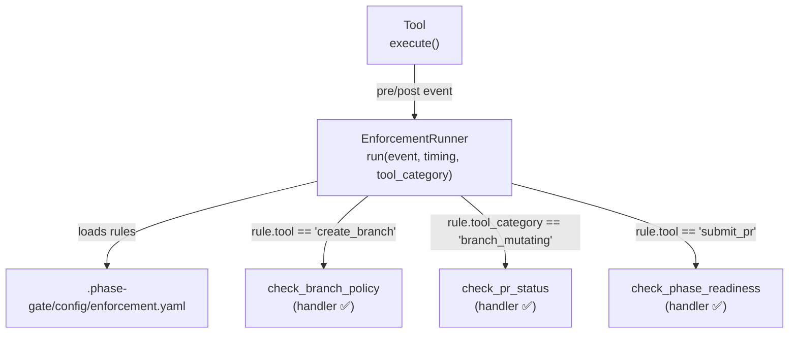
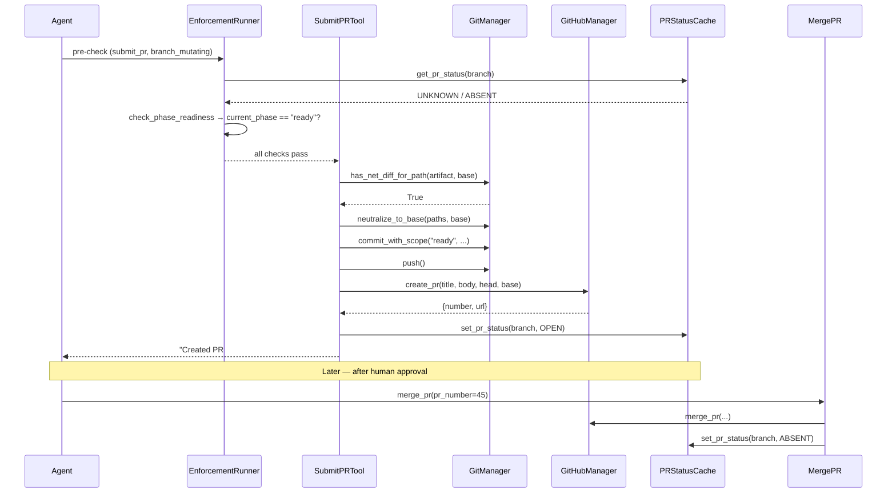
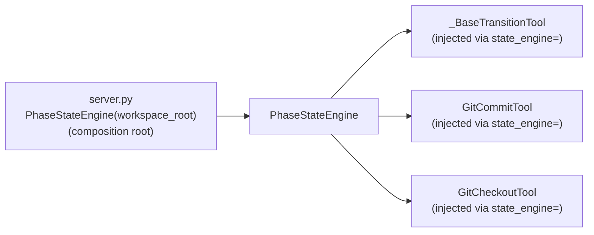

<!-- docs/mcp_server/architectural_diagrams/04_enforcement_layer.md -->
<!-- template=architecture version=8b924f78 created=2026-03-13T19:06Z updated=2026-04-23 -->
# Enforcement Layer

**Status:** CURRENT
**Version:** 2.0
**Last Updated:** 2026-04-23

---

## Purpose

Show the enforcement layer: how tool events trigger configured actions, which handlers are
registered, how the `BranchMutatingTool` category dispatches rules to all branch-mutating
tools via a single `enforcement.yaml` entry, and how `SubmitPRTool` performs the atomic
PR creation flow as a self-contained operation.

## Scope

**In Scope:** `EnforcementRunner`, `EnforcementRegistry`, `enforcement.yaml`,
`BranchMutatingTool`, `IPRStatusReader/Writer`, `PhaseStateEngine` instantiation routes

**Out of Scope:** Phase contract checks (see 02), git operation detail

---

## 1. Enforcement Dispatch Flow

When a tool is called, `EnforcementRunner` checks `enforcement.yaml` for matching `event_source`
+ `timing` rules and dispatches to the registered handler. The diagram shows the three currently
configured rules and two dispatch paths: by tool name and by tool category.

Dispatch matches on `rule.tool` (tool name) OR `rule.tool_category` (category) — these are
mutually exclusive per schema validator. A rule with neither field is skipped.

---

## 2. Currently Configured Rules

Three rules exist in `.phase-gate/config/enforcement.yaml`.

| # | Event Source | Match | Timing | Action | Effect |
|---|-------------|-------|--------|--------|--------|
| 1 | `create_branch` tool | by tool name | pre | `check_branch_policy` | Blocks branch creation from invalid bases (e.g. feature off a hotfix) |
| 2 | `tool_category: branch_mutating` | by category | pre | `check_pr_status` | Blocks all branch-mutating tools when `PRStatus.OPEN` exists for the current branch |
| 3 | `submit_pr` tool | by tool name | pre | `check_phase_readiness` | Blocks PR creation unless `state.json` shows `current_phase == "ready"` |

---

## 3. BranchMutatingTool Category

`BranchMutatingTool` is a zero-method ABC in `mcp_server/tools/base.py` that sets
`tool_category = "branch_mutating"`. Every tool that can mutate the branch inherits from it,
so rule #2 applies to all of them via a single `enforcement.yaml` entry.

```mermaid
graph TD
    BMT["BranchMutatingTool<br/>tool_category = 'branch_mutating'<br/>(base.py)"]

    CreateBranch["CreateBranchTool"]
    GitCommit["GitCommitTool"]
    GitRestore["GitRestoreTool"]
    GitPush["GitPushTool"]
    GitMerge["GitMergeTool"]
    GitDelete["GitDeleteBranchTool"]
    GitPull["GitPullTool"]
    SafeEdit["SafeEditTool"]
    SubmitPR["SubmitPRTool"]
    ScaffoldArtifact["ScaffoldArtifactTool"]
    InitProject["InitializeProjectTool"]
    SaveDeliverables["SavePlanningDeliverablesTool"]
    UpdateDeliverables["UpdatePlanningDeliverablesTool"]
    BaseTransition["_BaseTransitionTool<br/>(TransitionPhase / Force / Cycle / ForceCycle)"]

    BMT --> CreateBranch
    BMT --> GitCommit
    BMT --> GitRestore
    BMT --> GitPush
    BMT --> GitMerge
    BMT --> GitDelete
    BMT --> GitPull
    BMT --> SafeEdit
    BMT --> SubmitPR
    BMT --> ScaffoldArtifact
    BMT --> InitProject
    BMT --> SaveDeliverables
    BMT --> UpdateDeliverables
    BMT --> BaseTransition

    MergePR["MergePRTool<br/>⚠️ NOT branch_mutating<br/>(escape hatch)"]
    style MergePR fill:#ffe,color:#000
```

**`MergePRTool` is intentionally excluded.** It is the escape hatch that clears
`PRStatus.OPEN`. If it inherited `BranchMutatingTool`, rule #2 would block it while an open
PR exists — creating a deadlock where the PR can never be merged.

---

## 4. PR Status Lifecycle

`PRStatus` flows through a session-leading cache (`PRStatusCache`) backed by a cold-start
GitHub API fallback. `SubmitPRTool` writes `OPEN`; `MergePRTool` writes `ABSENT`.

---

## 5. Action Handlers

Three action handlers are registered in `EnforcementRunner._build_default_registry()`.

### `check_branch_policy`

Reads `action.rules[branch_type]` from `enforcement.yaml` → list of allowed base-branch
patterns (glob). Raises `ValidationError` if the requested `base_branch` does not match
any pattern. Produces `SuggestionNote` with the allowed bases.

### `check_pr_status`

Reads `IPRStatusReader.get_pr_status(branch)`. Branch is resolved from:
1. `context.get_param("head")` (explicit head param)
2. `_get_current_git_branch(workspace_root)` (git rev-parse)
3. `context.tool_name` (last resort)

Raises `ValidationError` when `PRStatus.OPEN`. Produces `SuggestionNote` to call `merge_pr`.
Raises `ConfigError` at startup if no `pr_status_reader` is injected.

### `check_phase_readiness`

Reads `action.policy` as the required phase name. Reads `current_phase` from
`.phase-gate/state.json` at call time (no caching). Raises `ValidationError` on mismatch or absent
state file. Produces `SuggestionNote` with `transition_phase(to_phase="<policy>")`.

---

## 6. PhaseStateEngine Instantiation

In the old architecture, `PhaseStateEngine` was instantiated in three places (composition
root, `EnforcementRunner._handle_commit_state_files`, `GitCommitTool.execute`). This
duplication was an RC-7 finding.

**Current state (resolved):** `PhaseStateEngine` is constructed once in `server.py` and
injected into all tools that need it (`_BaseTransitionTool` subclasses, `GitCommitTool`,
`GitCheckoutTool`, etc.). `_BaseTransitionTool._create_engine()` raises `ValueError` if
not injected — constructor injection is mandatory.

The `commit_state_files` handler that previously instantiated PSE inside
`EnforcementRunner` has been removed. State persistence after phase/cycle transitions
is now handled directly by the transition tools.

---

## Constraints & Decisions

| Decision | Rationale | Alternatives Rejected |
|----------|-----------|----------------------|
| YAML configuration for enforcement | Declarative; hot-reloadable without code changes | Hardcoded in Python (requires redeployment per rule change) |
| Registry validation at startup | Fail-fast on unknown action types; prevents silent runtime failures | Lazy validation per event (errors only surface during use) |
| `BranchMutatingTool` category for bulk rule dispatch | One `enforcement.yaml` entry covers all 18 branch-mutating tools | Individual tool entries (18× more config, easy to miss new tools) |
| `SubmitPRTool` owns artifact neutralization | Self-contained atomic flow; enforcement runner stays stateless | Enforcement runner pre-populates `ExclusionNote` list (removed in C6 GREEN) |
| `MergePRTool` excluded from `BranchMutatingTool` | Avoids `check_pr_status` deadlock — MergePR is the escape hatch | Including it → blocked while OPEN, so the PR could never be merged (deadlock) |
| `check_phase_readiness` reads state.json at call time | Always reflects live phase without session coupling | Cache with invalidation (over-engineered for a single file read) |

---

## Known Architectural Issues

| ID | Component | Issue | Severity |
|----|-----------|-------|----------|
| A-01 | `EnforcementRegistry` | Schema allows unknown `action.type` values that pass Pydantic but have no handler → `ConfigError` at startup | Low (fails fast) |
| Gap-6 | `enforcement.yaml` | No `event_source: merge` rule; no post-merge state cleanup | Medium |

---

## Related Documentation

- **[docs/mcp_server/architectural_diagrams/03_tool_layer.md][related-1]**
- **[docs/mcp_server/architectural_diagrams/05_config_layer.md][related-2]**
- **[docs/reference/mcp/tools/github.md][related-3]** — `submit_pr` tool reference

[related-1]: docs/mcp_server/architectural_diagrams/03_tool_layer.md
[related-2]: docs/mcp_server/architectural_diagrams/05_config_layer.md
[related-3]: docs/reference/mcp/tools/github.md
