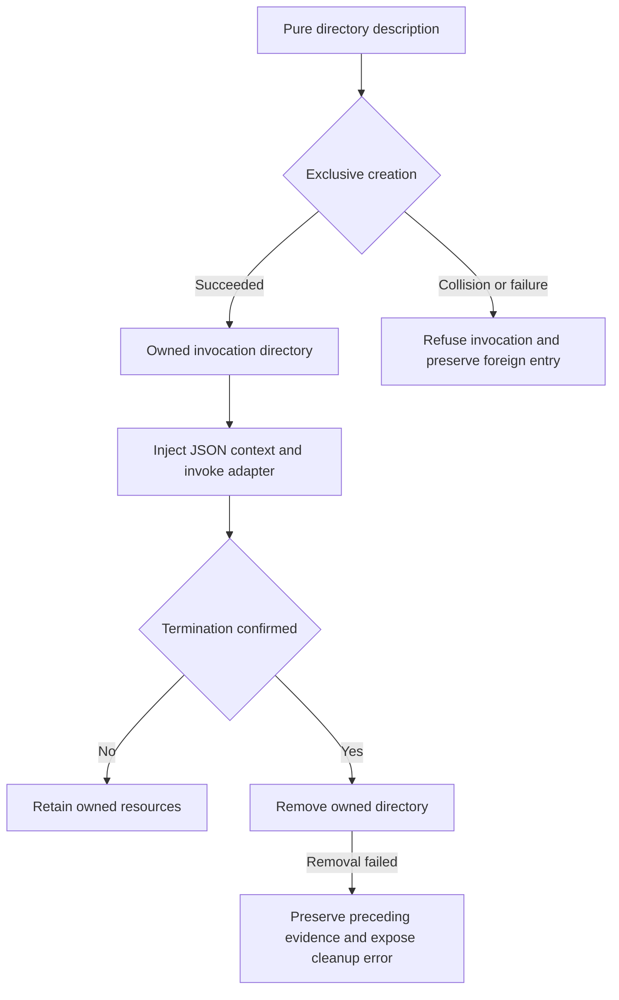

<!-- pgmcp:v1 id=reference pv=1.0.0 pf=6p2eztqyHAFsTyHx sf=9PfER5JkyAoFQLRi -->

# Native Adapter Execution Contract

**Status:** Current
**Version:** 1.0
**Last Updated:** 2026-10-02


## Purpose

Explain the current internal check/test/fix contract, invocation ownership, native transport limits and observable result behavior for operators and adapter contributors.

## Scope In

The directly corrected unreleased contract identity 1; bundled adapter behavior and PGMCP invocation lifetime.

## Scope Out

OS confinement, external migration or legacy compatibility routes, automatic dependency installation, and workflow approval.


## Sources

- [Strict request/response DTOs][src-1]
- [Check wire schema][src-2]
- [Test wire schema][src-3]
- [Fix wire schema][src-4]
- [Process runtime][src-5]
- [Composition root][src-6]

[src-1]: <../../mcp_server/execution/protocol.py>
[src-2]: <../../mcp_server/execution/contracts/check_v1.schema.json>
[src-3]: <../../mcp_server/execution/contracts/test_v1.schema.json>
[src-4]: <../../mcp_server/execution/contracts/fix_v1.schema.json>
[src-5]: <../../mcp_server/execution/process_runtime.py>
[src-6]: <../../mcp_server/bootstrap.py>


## Test Evidence

- [Actual native regressions][test-1]
- [Invocation/resource regressions][test-2]
- [Installed consumer][test-3]

[test-1]: <../../tests/mcp_server/integration/adapters>
[test-2]: <../../tests/mcp_server/integration/execution/test_process_runtime.py>
[test-3]: <../../tests/mcp_server/integration/test_installed_distribution_v3.py>


## API Reference


### Public caller intent and mandatory adapter context

The public run_checks/run_tests/apply_fixes tools accept workspace-relative targets and native arguments under their separate live input schemas. PGMCP resolves the admitted selection, creates an invocation allocation and injects execution_context into the internal JSON request. Public callers do not supply that internal context field.

Every adapter request variant requires the closed object execution_context.scratch_directory: a nonempty absolute path without NUL. This supplements the operation/args and selection or content fields; it is not a standalone request. Missing fields, extra context fields, wrong types and malformed paths yield invalid_request with the nested location and protocol exit 2, before analysis or mutation. Filesystem usability is established only where a native transport actually needs it. Content/stdin-only adapters validate shape without inventing a write probe.

The internal contract remains identity 1 (check_v1/test_v1/fix_v1). It is one directly corrected development contract; existing direct consumers must provide the complete request. There is no implicit directory fallback, PGMCP environment channel or parallel legacy envelope.


**Sources:**

- [Protocol][api-1-src-1]
- [Public tools][api-1-src-2]

[api-1-src-1]: <../../mcp_server/execution/protocol.py>
[api-1-src-2]: <tools/quality.md>


### Invocation directory lifecycle

PGMCP derives the validation root from the already resolved server root. A frozen directory description is a pure calculation; it does not allocate or reserve anything. Exclusive creation establishes cleanup ownership. A collision or foreign allocation is never adopted or removed.

The runtime supplies the already created absolute directory to the adapter. Adapters may create their native argument files there; they do not select another root or clean the allocation. PGMCP removes only the successfully owned invocation directory after confirmed process termination. Unconfirmed termination retains it for recovery. This is not a general cleanup sweep and never removes native tool caches. Content-input snapshots have separate ownership and must outlive their own check.

Direct entrypoint consumers, including test fixtures, must allocate and manage a valid supplied directory for the complete invocation. The directory string alone proves neither ownership nor OS confinement.




**Sources:**

- [Directory interface][api-2-src-1]
- [Exclusive filesystem provider][api-2-src-2]
- [Temporary root derivation][api-2-src-3]
- [Installed direct consumer example][api-2-src-4]

[api-2-src-1]: <../../mcp_server/core/interfaces/execution.py>
[api-2-src-2]: <../../mcp_server/execution/invocation_scratch.py>
[api-2-src-3]: <../../mcp_server/utils/path_resolver.py>
[api-2-src-4]: <../../tests/mcp_server/integration/test_installed_distribution_v3.py>


### Complete native selection transport

Each package translates one admitted request into one complete native operation. It does not batch analyses, drop late targets or substitute workspace discovery. Native argument-file grammar is used rather than shell quoting. Unrepresentable tokens are refused as unsupported_input before analysis.

| Adapter/role | Native channel | Relevant boundary |
|---|---|---|
| Ruff check lint/format and fix | Complete ordered native argument vector in @file inside the supplied directory | Caller response files are refused; check/fix source and operation guards remain |
| Mypy check | Complete ordered arguments/targets in @file | Configured discovery and supported deliberate native expansion remain; caller response files are refused |
| Pytest test | Complete ordered vector in @file to a fresh native child | Effective metadata guard, configured discovery, plugins/xdist, intentional collect-only and exit 5 remain; admitted caller response files retain the effective guard |
| Pyright check | Adapter-owned nonempty filename list on native child stdin with the native '-' marker | Scalar option values remain argv; empty selection retains configured discovery; caller file-channel replacement/addition is refused |
| Lychee selection check | --files-from - on native stdin when that channel is free | Literal glob escaping remains; an existing caller/config files_from keeps the positional route and its argv-size limit |
| Content checks | Existing snapshot or message transport | No large target-vector substitution; required context still applies |

The adapter's JSON stdin and the native child's filename/message stdin are distinct. Remaining argv-only option payloads can still exceed native launch limits; the adapter reports the actual inability instead of changing the selection.


**Sources:**

- [Ruff][api-3-src-1]
- [Mypy][api-3-src-2]
- [Pytest][api-3-src-3]
- [Pyright][api-3-src-4]
- [Lychee][api-3-src-5]

[api-3-src-1]: <../../mcp_server/bundled_adapters/ruff/check.py>
[api-3-src-2]: <../../mcp_server/bundled_adapters/mypy/check.py>
[api-3-src-3]: <../../mcp_server/bundled_adapters/pytest/test.py>
[api-3-src-4]: <../../mcp_server/bundled_adapters/pyright/check.cjs>
[api-3-src-5]: <../../mcp_server/bundled_adapters/lychee/check.py>


### Pinned Pyright filename convention

Pyright 1.1.408 reads one literal filename per line from its native stdin channel and provides no quoting/escaping convention that preserves a filename containing an ordinary space. CR/LF, native leading/trailing trimming and invalid UTF-8 also cannot faithfully represent an explicit filename. The adapter refuses the whole explicit selection as unsupported_input if any filename is unrepresentable; it does not normalize, split, quote or fall back to argv.

Use representable explicit filenames. Empty selection remains a native configured-discovery request and can discover space-containing paths. This is an explicit supported-input boundary, not a general filesystem-path restriction.


**Sources:**

- [Pinned package declaration][api-4-src-1]
- [Supported/refused filename regressions][api-4-src-2]

[api-4-src-1]: <../../mcp_server/bundled_adapters/pyright/package.json>
[api-4-src-2]: <../../tests/mcp_server/integration/adapters/test_pyright.py>


### Native effects under trusted host-account execution

Native settings retain their ordinary precedence and meanings. Operational caches/state and compatible supplemental reports may use operator-selected locations, including outside selected source files. PGMCP neither chooses a supposedly safe cache destination nor removes native caches on completion.

| Native effect/input | Behavior and reason |
|---|---|
| Ruff/Mypy cache settings and destinations; Lychee cache/cookie state | Allowed ordinary native effects |
| Mypy compatible supplemental reports and statistics | Allowed when status/diagnostics remain captured; missing optional report prerequisites stay truthful native inability |
| Ruff output-file or RUFF_OUTPUT_FILE; Lychee output destination | Refused where they replace the captured diagnostics required by the result contract |
| Check source-fixing modes, fix source additions/replacements, alternate source/metadata operations | Existing role/input guards apply; a requested check must not become a different operation |
| Dependency installation through an analysis request | Unsupported operation; prerequisites remain operator responsibility |

These guards protect selection, operation and result semantics. They do not isolate the native tool, plugins or adapter from host-account filesystem, network or credential access. Trusted personal/local execution is the supported model.


**Sources:**

- [Ruff check guards][api-5-src-1]
- [Ruff fix guards][api-5-src-2]
- [Mypy native effects][api-5-src-3]
- [Lychee native effects][api-5-src-4]

[api-5-src-1]: <../../mcp_server/bundled_adapters/ruff/check.py>
[api-5-src-2]: <../../mcp_server/bundled_adapters/ruff/fix.py>
[api-5-src-3]: <../../mcp_server/bundled_adapters/mypy/check.py>
[api-5-src-4]: <../../mcp_server/bundled_adapters/lychee/check.py>


### Versions, completion and causal diagnostics

The package-local dependency declaration is authoritative for each pinned main tool: Ruff/Mypy/Pytest requirements.txt, Pyright/Commitlint package.json and Lychee dependencies.json. Adapters read that declaration on use, observe the actual version and refuse missing, unreadable or mismatched prerequisites as dependency_unavailable before version-dependent analysis or source mutation. Available actual and expected versions remain visible. Stdlib-only adapters report their actual runtime; TypeScript syntax uses its declared dependency.

Metadata/help/show/watch and substitute operations do not prove the requested check/test/fix ran. They are refused where unsupported. Deliberately admitted Ruff --exit-zero, Pytest --collect-only and native exit 5 keep their native policies.

A native negative result is distinct from native inability and invocation failure. Ruff usage/configuration/access classification follows causal native records; quoted arguments or filenames containing words such as 'os error' or 'unknown option' do not independently determine the cause. Evidence retains useful native diagnostics and verbosity.


**Sources:**

- [Ruff dependency][api-6-src-1]
- [Mypy dependency][api-6-src-2]
- [Pytest dependencies][api-6-src-3]
- [Commitlint dependencies][api-6-src-4]
- [Lychee dependency][api-6-src-5]
- [TypeScript dependency][api-6-src-6]

[api-6-src-1]: <../../mcp_server/bundled_adapters/ruff/requirements.txt>
[api-6-src-2]: <../../mcp_server/bundled_adapters/mypy/requirements.txt>
[api-6-src-3]: <../../mcp_server/bundled_adapters/pytest/requirements.txt>
[api-6-src-4]: <../../mcp_server/bundled_adapters/commitlint/package.json>
[api-6-src-5]: <../../mcp_server/bundled_adapters/lychee/dependencies.json>
[api-6-src-6]: <../../mcp_server/bundled_adapters/typescript_syntax/package.json>


### Resource failures, fixes and complete evidence

If directory removal fails after an accepted response, the invocation reports its resource failure and preserves the complete preceding adapter response as JSON evidence, including native diagnostics and the prior outcome. Raw accepted stdout head/tail may be absent because its parsed response is authoritative; byte counts alone are not the retained result. A completed fix may already have modified sources, so inspect its preserved outcome and affected files.

Cancellation, request rejection and preceding process failure retain their primary state and append the cleanup cause in public check/test/fix/content projections. Unconfirmed process termination retains the allocation. Fixes are ordered and do not promise atomic rollback.

Read the complete cached DTO rather than recovering facts from the bounded text projection. Paged reads require contiguous offsets, stable run/hash/length metadata, complete Unicode-codepoint assembly and UTF-8 SHA256 verification before parsing. Caches are transient. The MCP client deadline must allow the chosen invocation deadline, termination and result processing; increasing a runtime deadline while the client expires earlier cannot yield a complete receipt.


**Sources:**

- [Runtime resource handling][api-7-src-1]
- [Public result models][api-7-src-2]
- [Complete cache reading][api-7-src-3]
- [Tool result guidance][api-7-src-4]

[api-7-src-1]: <../../mcp_server/execution/process_runtime.py>
[api-7-src-2]: <../../mcp_server/schemas/execution_outputs.py>
[api-7-src-3]: <../../mcp_server/resources/cache_reading.md>
[api-7-src-4]: <tools/quality.md>


## Usage Examples


### Internal selection request — allocation already created and owned by its caller

```json
{
  "operation": "lint",
  "targets": [
    "C:\\workspace\\src\\sample.py"
  ],
  "args": [],
  "execution_context": {
    "scratch_directory": "C:\\temporary-root\\invocation-example"
  }
}
```


## Related Documents

- [Checks/tests/fixes](<tools/quality.md>)
- [Server configuration](<server-configuration.md>)

