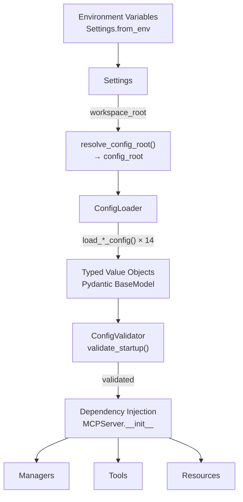
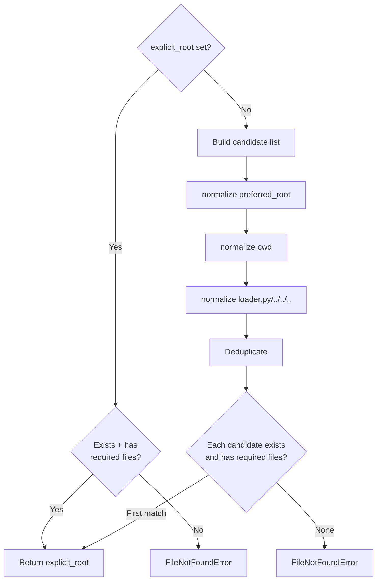
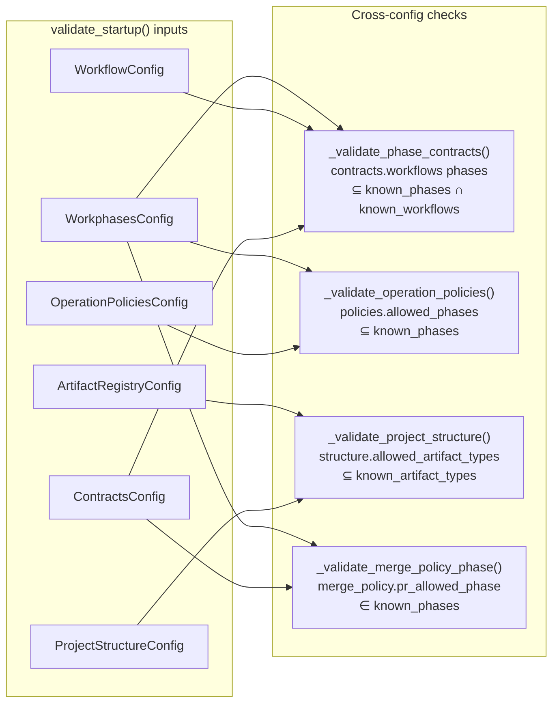
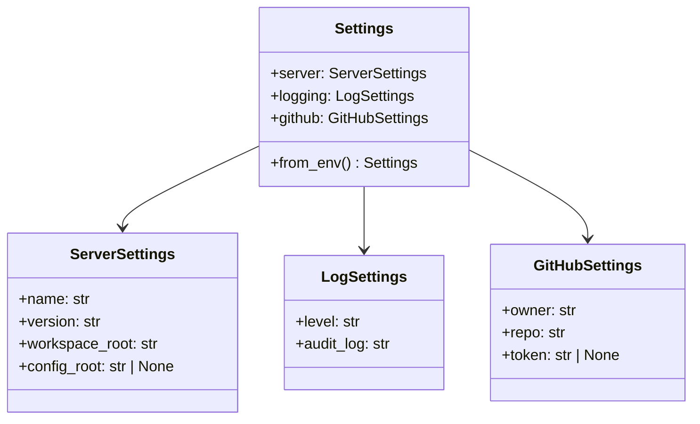
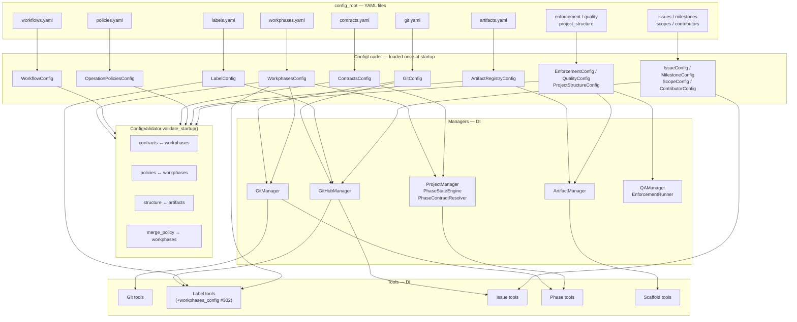

<!-- docs\reference\mcp\config-loading-architecture.md -->
<!-- template=reference version=064954ea created=2026-05-07T07:49Z updated= -->
# MCP Server — Configuration Loading Architecture

**Status:** DEFINITIVE
**Version:** 1.0
**Last Updated:** 2026-05-07

**Source:** [mcp_server/config/loader.py](../../../mcp_server/config/loader.py)
**Tests:** [tests/unit/config/test_c_loader_structural.py](../../../tests/unit/config/test_c_loader_structural.py) (20 tests)

---

## Overview

The MCP server uses a layered, immutable configuration architecture. All YAML files under
the resolved `config_root` are loaded **once at startup** into typed Pydantic value objects. Those
objects are passed as constructor arguments (dependency injection) into managers and tools —
no component re-reads YAML at runtime.



---

## API Reference

### `normalize_config_root(path)`

**Module:** `mcp_server/config/loader.py`

A helper that normalises any path variant to its config subdirectory form using the
**default `.st3/config` convention**. Not called when `ST3_CONFIG_ROOT` is set — in
that case `resolve_config_root` uses the explicit path directly.

| Input form | Output (default convention) |
|------------|-----------------------------|
| `<workspace>` | `<workspace>/.st3/config` |
| `<workspace>/.st3` | `<workspace>/.st3/config` |
| `<workspace>/.st3/config` | unchanged |

---

### `resolve_config_root(preferred_root, explicit_root, required_files)`

**Module:** `mcp_server/config/loader.py`

Resolves the config root directory without
legacy fallbacks. Raises `FileNotFoundError` when no candidate satisfies `required_files`.



**Called in production** (`server.py` line 161) with:
```python
resolve_config_root(
    preferred_root=workspace_root,
    required_files=("git.yaml", "workflows.yaml", "workphases.yaml"),
)
```

---

### `ConfigLoader`

**Module:** `mcp_server/config/loader.py`

Takes a `config_root: Path` in its constructor. Each `load_*` method:
1. Calls `_load_yaml(filename)` → reads YAML, returns `(dict, resolved_path)`
2. Passes the dict to `_validate_schema(SchemaClass, data, path)` → Pydantic `model_validate`

**Config File → Schema Map:**

| YAML file | `load_*` method | Schema class | Special processing |
|-----------|----------------|--------------|-------------------|
| `git.yaml` | `load_git_config` | `GitConfig` | — |
| `labels.yaml` | `load_label_config` | `LabelConfig` | — |
| `scopes.yaml` | `load_scope_config` | `ScopeConfig` | — |
| `workflows.yaml` | `load_workflow_config` | `WorkflowConfig` | — |
| `workphases.yaml` | `load_workphases_config` | `WorkphasesConfig` | — |
| `artifacts.yaml` | `load_artifact_registry_config` | `ArtifactRegistryConfig` | Custom YAML open + `model_validate` (bypasses `_load_yaml`) |
| `contributors.yaml` | `load_contributor_config` | `ContributorConfig` | — |
| `issues.yaml` | `load_issue_config` | `IssueConfig` | — |
| `milestones.yaml` | `load_milestone_config` | `MilestoneConfig` | — |
| `policies.yaml` | `load_operation_policies_config` | `OperationPoliciesConfig` | Pre-injects `operation_id` key per operation entry |
| `project_structure.yaml` | `load_project_structure_config` | `ProjectStructureConfig` | Optional `artifact_registry` param for path resolution |
| `quality.yaml` | `load_quality_config` | `QualityConfig` | — |
| `contracts.yaml` | `load_contracts_config` | `ContractsConfig` | — |
| `enforcement.yaml` | `load_enforcement_config` | `EnforcementConfig` | — |
| `scaffold_metadata.yaml` | `load_scaffold_metadata_config` | `ScaffoldMetadataConfig` | — |

**Schema module locations** (`mcp_server/config/schemas/`):

```
mcp_server/config/schemas/
├── __init__.py                      ← re-exports all schema classes
├── artifact_registry_config.py      ← ArtifactRegistryConfig
├── contracts_config.py              ← ContractsConfig
├── contributor_config.py            ← ContributorConfig
├── enforcement_config.py            ← EnforcementConfig
├── git_config.py                    ← GitConfig
├── issue_config.py                  ← IssueConfig
├── label_config.py                  ← LabelConfig, Label, LabelPattern
├── milestone_config.py              ← MilestoneConfig
├── operation_policies_config.py     ← OperationPoliciesConfig
├── project_structure_config.py      ← ProjectStructureConfig
├── quality_config.py                ← QualityConfig
├── scaffold_metadata_config.py      ← ScaffoldMetadataConfig
├── scope_config.py                  ← ScopeConfig
├── workflows.py                     ← WorkflowConfig
└── workphases.py                    ← WorkphasesConfig
```

---

### `ConfigValidator.validate_startup()`

**Module:** `mcp_server/config/validator.py`

Called after all configs are loaded, before any manager is constructed. Raises `ConfigError`
on any violation — server fails to start.



---

### `Settings.from_env()`

**Module:** `mcp_server/config/settings.py`

Loads runtime settings from environment variables. Separate from domain configs — controls
server behaviour, not domain data.



| Environment variable | Maps to | Default |
|----------------------|---------|---------|
| `GITHUB_TOKEN` | `settings.github.token` | `None` — GitHub tools disabled |
| `ST3_WORKSPACE_ROOT` | `settings.server.workspace_root` | `os.getcwd()` |
| `ST3_CONFIG_ROOT` | `settings.server.config_root` | `None` — auto-resolved |
| `LOG_LEVEL` | `settings.logging.level` | `"INFO"` |

---

### `validate_phase_label(name, workphases)`

**Module:** `mcp_server/config/schemas/label_config.py` (added in issue #302)

Module-level free function. Validates that a `phase:*` label's suffix is a known top-level
phase from `WorkphasesConfig`. Only top-level phase keys are valid issue labels — subphases
(`red`, `green`, `contracts`, `e2e`) are commit-level granularity and rejected.

```python
def validate_phase_label(name: str, workphases: WorkphasesConfig) -> tuple[bool, str]:
    if not name.startswith("phase:"):
        return (True, "")       # non-phase labels pass through
    suffix = name.removeprefix("phase:")
    valid_phases = set(workphases.phases.keys())
    if suffix not in valid_phases:
        return (False, f"Label '{name}' references unknown workphase '{suffix}'. ...")
    return (True, "")
```

Called as **second step** after `LabelConfig.validate_label_name()` (format check) in
`AddLabelsTool` and `CreateLabelTool`.

---

## Usage Examples

### Startup sequence in `MCPServer.__init__`

```python
# 1. Resolve config root
config_root = resolve_config_root(
    preferred_root=workspace_root,
    required_files=("git.yaml", "workflows.yaml", "workphases.yaml"),
)

# 2. Load all configs (immutable from this point)
config_loader = ConfigLoader(config_root=config_root)
workphases_config = config_loader.load_workphases_config()
label_config = config_loader.load_label_config()
# ... (14+ load_* calls total)

# 3. Cross-config validation (raises ConfigError on violation)
ConfigValidator().validate_startup(
    policies=operation_policies_config,
    workflow=workflow_config,
    structure=project_structure_config,
    artifact=artifact_registry,
    contracts=contracts_config,
    workphases=workphases_config,
)

# 4. Inject into tools
AddLabelsTool(
    manager=self.github_manager,
    label_config=label_config,
    workphases_config=workphases_config,   # added in issue #302
)
```

### Test Pattern 1 — Real config (integration tests)

```python
from mcp_server.config.loader import ConfigLoader
from pathlib import Path

workphases_config = ConfigLoader(resolve_config_root(Path.cwd())).load_workphases_config()
```

### Test Pattern 2 — Inline YAML via `tmp_path` (unit tests)

```python
def _load_label_config(tmp_path: Path, yaml_content: str) -> LabelConfig:
    yaml_file = tmp_path / "labels.yaml"
    yaml_file.write_text(yaml_content)
    return ConfigLoader(tmp_path).load_label_config(config_path=yaml_file)
```

The `config_path` override bypasses the default `config_root / filename` lookup —
the primary isolation mechanism for unit tests with custom minimal configs.

### Test Pattern 3 — Shared fixtures (`tests/mcp_server/fixtures/workflow_fixtures.py`)

```python
# Registered globally via tests/conftest.py
@pytest.fixture
def contracts_config() -> ContractsConfig:
    return ConfigLoader(resolve_config_root(Path.cwd())).load_contracts_config()
```

Available fixtures: `workflow_config`, `contracts_config`, `workflow_phases`,
`feature_phases`, `bug_phases`, `hotfix_phases`.

---

## Dependency Injection Map

Full config VO → consumer map (managers and tools):

| Config VO | Direct consumers |
|-----------|-----------------|
| `GitConfig` | `GitManager`, `GitHubManager`, `StateReconstructor`, `ListPRsTool`, `MergePRTool`, `EnforcementRunner` |
| `WorkphasesConfig` | `GitManager`, `ProjectManager`, `PhaseStateEngine`, `ScopeDecoder`, `CommitPhaseDetector`, `GetWorkContextTool`, `AddLabelsTool`*, `CreateLabelTool`* |
| `WorkflowConfig` | `ConfigValidator` (startup only) |
| `LabelConfig` | `GitHubManager`, `AddLabelsTool`, `CreateLabelTool`, `DeleteLabelTool`, `ListLabelsTool`, `RemoveLabelsTool` |
| `IssueConfig` | `GitHubManager`, `CreateIssueTool` |
| `ScopeConfig` | `GitHubManager` |
| `MilestoneConfig` | `GitHubManager` |
| `ContributorConfig` | `GitHubManager` |
| `ContractsConfig` | `ProjectManager`, `PhaseContractResolver`, `PhaseStateEngine`, `ConfigValidator`, `MergeReadinessContext`, `CreateIssueTool` |
| `ArtifactRegistryConfig` | `ArtifactManager`, `ConfigValidator` |
| `ProjectStructureConfig` | `ArtifactManager`, `ConfigValidator` |
| `OperationPoliciesConfig` | `ConfigValidator` (startup only) |
| `EnforcementConfig` | `EnforcementRunner` |
| `QualityConfig` | `QAManager` |

\* Added in issue #302

---

## End-to-End Flow



---

## Design Invariants

1. **Immutable after load:** All config value objects use `frozen=True` or `ConfigDict(frozen=True)`. No mutation at runtime.
2. **Single load point:** `ConfigLoader` is constructed once in `MCPServer.__init__`. No lazy loading, no singleton registry.
3. **No config re-reads at runtime:** Tools and managers hold references to config VOs. Exception: `CommitPhaseDetector` constructs its own `ConfigLoader` lazily when called outside server context.
4. **`config_path` override for tests:** Every `load_*` method accepts `config_path: Path | None` to bypass the default `config_root / filename` lookup. Primary isolation mechanism for unit tests.
5. **Cross-config validation at startup only:** `ConfigValidator.validate_startup()` enforces referential integrity once. No runtime re-validation.
6. **Use-time semantic validation for `phase:*`:** `validate_phase_label()` enforces workphase-backed semantics at the point of label assignment/creation (not at startup). Injected via `workphases_config` constructor parameter in label tools.

---

## Adding a New Config File

1. Create schema in `mcp_server/config/schemas/new_thing.py` (Pydantic `BaseModel`)
2. Export from `mcp_server/config/schemas/__init__.py`
3. Add `load_new_thing_config()` to `ConfigLoader`
4. Load in `MCPServer.__init__` before `ConfigValidator.validate_startup()`
5. If the new config references workphases or artifact types, add a cross-validation check to `ConfigValidator`
6. Inject into managers/tools that need it
7. Add shared fixture in `tests/mcp_server/fixtures/` if widely used across tests
