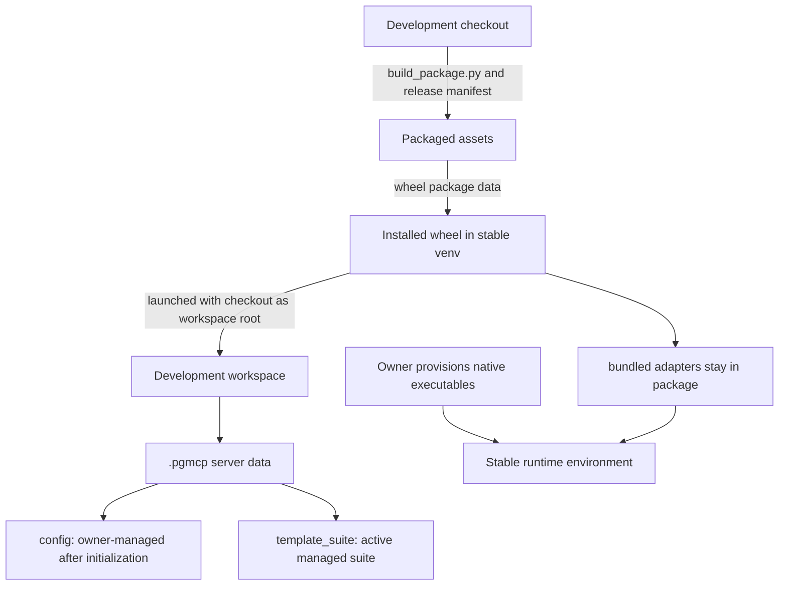

<!-- docs\setup\dev-isolation.md -->
<!-- template=generic_doc version=43c84181 created=2026-07-08T05:42Z updated= -->

# Developer Isolation

**Status:** APPROVED  
**Version:** 1.1  
**Last Updated:** 2026-09-24

---

## Purpose

Run the installed PGMCP package from a dedicated Python environment while it operates
on a separate development checkout. Launch from a neutral working directory outside
the checkout so Python resolves the proxy and child server from the installed wheel,
while `PGMCP_WORKSPACE_ROOT` directs workspace operations to the checkout.

## Prerequisites

- Python 3.11 or later and pip.
- The `build` package in the development environment (`python -m pip install build`).
- Owner-installed native executables required by the configured check, test, and fix
  adapters in the stable runtime environment. PGMCP does not install native dependencies
  during setup or renewal.

## Roots and ownership

The default workspace root is the launch working directory. The default server-data root
is `.pgmcp/` under that workspace. Configuration resolves to
`<server-root>/config` and the managed template suite to
`<server-root>/template_suite`, unless `PGMCP_CONFIG_ROOT` or
`PGMCP_TEMPLATE_ROOT` selects another path. An explicit root remains authoritative and
owner-managed; package defaults are initial-install material and migration references,
not a fallback that silently fills an existing configuration.



## Build and install the wheel

Create a stable runtime environment, build the package from the checkout, then install
the generated wheel into that environment:

```powershell
python -m venv pgmcp_stable_venv
python -m pip install build
python scripts/build_package.py

$wheel = Get-ChildItem .\dist\phase_gate_mcp-*.whl | Sort-Object LastWriteTime -Descending | Select-Object -First 1
& .\pgmcp_stable_venv\Scripts\python.exe -m pip install --force-reinstall $wheel.FullName
```

The build assembles `mcp_server/assets/` from
`.pgmcp/config/release_manifest.yaml` and then builds the wheel. The wheel includes
those assets plus `mcp_server/bundled_adapters/` as package data. Official adapters
remain inside the package; they are not copied into the workspace. Native programs such
as checkers or test runners must be installed and available in the environment that
launches the adapter. Workspace adapters under the server root remain owner-managed and
must be explicitly trusted in configuration.

## Initialize or migrate a workspace

Set `PGMCP_WORKSPACE_ROOT` to the development checkout and
`PGMCP_SERVER_PROJECT_DIR` to the intended server-data directory (default: `.pgmcp`).
For a new workspace, `pgmcp --init` requires that the resolved server root does not
already exist. It copies packaged assets into that root and runs the normal renewal
operation to establish installation state. It is not an upgrade command.

For a pre-v3 workspace, run `pgmcp --upgrade`. When no trusted checkpoint exists and
the complete active suite cannot be established as equal to the validated candidate,
renewal preserves the active suite and reports `checkpoint_required` (exit code 2)
after staging and validation. An equal active suite can establish its initial checkpoint
automatically; renewal does not silently replace a differing suite.
For a managed root, the owner may choose `--force-template-upgrade`, which makes a
verified backup before installing the candidate, or first reconcile a complete valid v3
suite and use `--accept-template-baseline` to record the baseline without copying over
that reconciled suite. For an external template root, the owner decides and performs or
authorizes the equivalent migration; PGMCP does not force-replace it.

The effective configuration root, including an external `PGMCP_CONFIG_ROOT`, remains
owner-controlled during renewal. Review and explicitly migrate existing configuration
against the shipped defaults when needed; renewal does not silently fill, translate, or
overwrite it. See the [workspace upgrade guide](workspace-upgrade.md).

## Launch the installed server against the checkout

Configure the MCP client to use the stable environment's Python executable and the
installed package's proxy entrypoint. Use an existing neutral working directory outside
the source checkout for the process `cwd`; point `PGMCP_WORKSPACE_ROOT` at the checkout
for workspace operations. Leave `PYTHONPATH` unset. Python puts the process working
directory on its module search path for `-m`, so launching from the checkout would load
its source package instead of the installed wheel:

```json
{
  "command": "C:/path/to/pgmcp_stable_venv/Scripts/python.exe",
  "args": ["-m", "mcp_server.core.proxy"],
  "cwd": "C:/path/to/neutral-launch-dir",
  "env": {
    "PGMCP_WORKSPACE_ROOT": "C:/path/to/development-checkout",
    "PGMCP_SERVER_PROJECT_DIR": ".pgmcp"
  }
}
```

Add other owner-selected settings such as `PGMCP_CONFIG_ROOT`,
`PGMCP_TEMPLATE_ROOT`, and GitHub credentials as required. Do not copy credentials
into tracked setup files.

## Development and reload loop

1. Edit source and workspace files in the checkout.
2. Run development checks in the development environment as required by the active
   workflow contract.
3. Rebuild and reinstall the wheel when testing package changes.
4. Restart the MCP server after installing package changes or changing startup-loaded
   configuration or the active template suite. If launch environment variables change,
   relaunch the client so the new environment reaches the proxy and child server.
5. From the same neutral working directory and stable interpreter, inspect
   `mcp_server.__file__` and confirm that it resolves inside the stable environment's
   `site-packages`, not the source checkout. Verify the effective workspace and server
   roots through the normal runtime context before relying on the session.

No health-first gate is required for this reload procedure.

## Related Documentation

- [Workspace upgrade guide](workspace-upgrade.md)
- [Release assets procedure](../reference/release-assets-procedure.md)
- [Server configuration](../reference/server-configuration.md)
- [Package source and build script](../../scripts/build_package.py)
